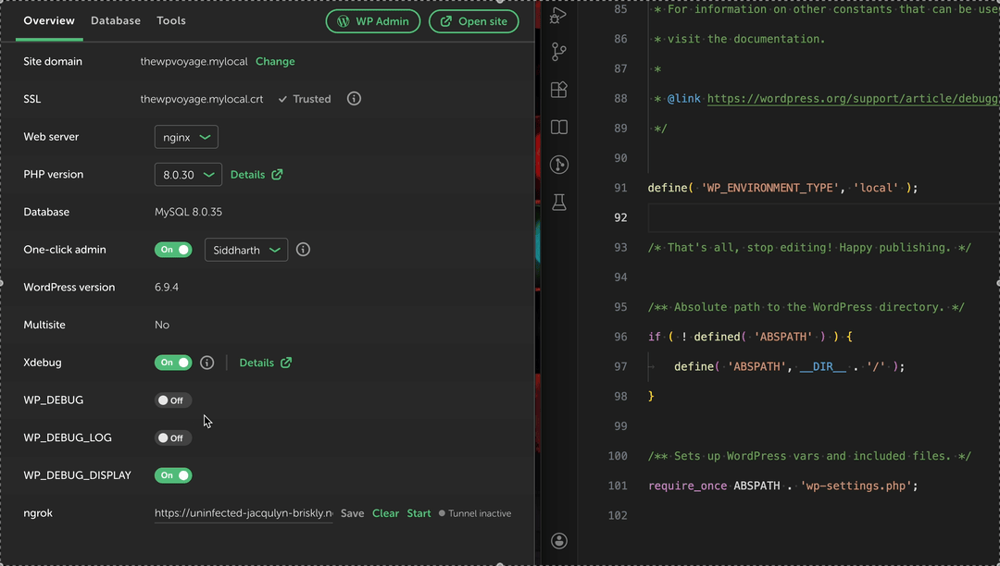
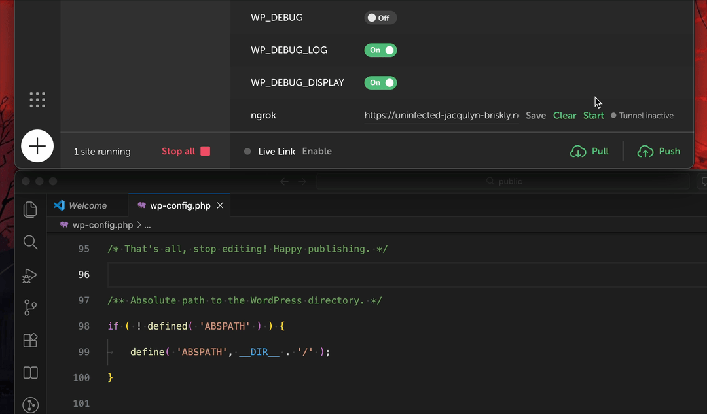

# Local WordPress Supercharged

A [Local by Flywheel](https://localwp.com/) addon that supercharges your local WordPress development workflow -- toggle debug constants, test plugin conflicts, start ngrok tunnels, and more.

## Features

- [Conflict Testing](#conflict-testing)
- [One-Click ngrok Tunnels](#one-click-ngrok-tunnels)
- [Toggle Debug Constants](#toggle-debug-constants)

### Conflict Testing

Test plugin conflicts without modifying the database. Toggle plugins on/off via filter hooks -- changes take effect on the next page load and can be reset instantly.


- **No database changes** -- uses the `option_active_plugins` filter hook to intercept plugin loading at runtime
- **Cascade deactivation** -- deactivating WooCommerce automatically deactivates all plugins that depend on it
- **Cascade activation** -- activating a dependent plugin automatically activates its requirements
- **Dependency awareness** -- reads WordPress 6.5+ `RequiresPlugins` headers to map plugin relationships
- **Reset All** -- one click restores original database state
- **DB vs Active indicators** -- clearly shows the real database status vs the overridden runtime state

### Toggle Debug Constants

Toggle `WP_DEBUG`, `WP_DEBUG_LOG`, `WP_DEBUG_DISPLAY`, and `SCRIPT_DEBUG` from the Site Overview page. No more editing `wp-config.php` by hand.



- **Instant switching** -- cached values mean zero delay when switching between sites
- **Live sync** -- edit `wp-config.php` externally and the UI updates in real time
- **Optimistic UI** -- switches update immediately, roll back on failure

### One-Click ngrok Tunnels

Expose your local WordPress site to the internet in one click. Paste your ngrok URL, hit Start, and you're live.



- **One button** -- Start enables `WP_HOME`/`WP_SITEURL` and launches the tunnel. Stop reverses everything.
- **Live status indicator** -- see at a glance if your tunnel is active
- **Collision detection** -- handles multiple sites sharing the same ngrok URL gracefully
- **Auto-cleanup** -- tunnels are killed automatically when a site is stopped
- **Inline error reporting** -- ngrok errors surface directly in the UI

## Installation

Clone into the Local addons directory:

- **macOS**: `~/Library/Application Support/Local/addons`
- **Windows**: `C:\Users\username\AppData\Roaming\Local\addons`
- **Linux**: `~/.config/Local/addons`

Then:

```bash
yarn install
yarn build
```

Open Local and enable the addon.

## Development

```bash
yarn build        # Compile TypeScript
yarn watch        # Compile in watch mode
yarn test         # Run tests
```

### Project Structure

```
src/
  main.ts              # Main process entry point
  renderer.tsx          # Renderer process entry point
  shared/types.ts       # Shared types, constants, IPC channels
  features/
    debug-constants/    # WP_DEBUG toggle feature
    ngrok/              # ngrok tunnel feature
    conflict-test/      # Plugin conflict testing feature
```

Each feature is self-contained under `src/features/`.

## License

MIT
